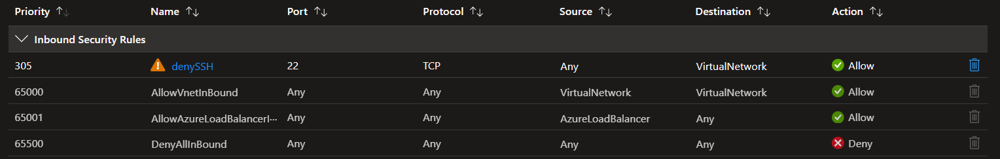
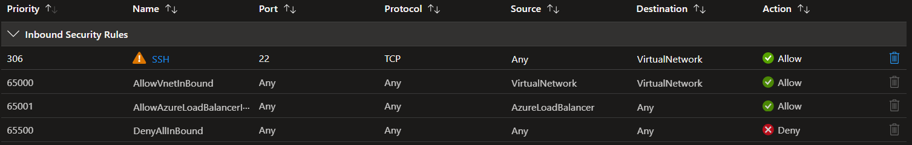

# Azure Networking Basics - Network Security Groups

Created a virtual network "VNet" and two subents to it "App" and "DB"  
To each subent deployed a VM, "appVM" and "dbVM"  
Created two different NSGs, "appVM-nsg" and "nic-nsg"  
Assiged appVM-nsg to the VNet  
Assigned nic-nsg to the NIC of the appVM  
Both of the VMs have public IP addresses assigned

Created following custom inbound security rules for nic-nsg:

Created rule for appVM-nsg as well:

No custom outbound rules were created in both NSGs

## Observation:
With the current set up, I was allowed SSH access to the appVM, eventhough a higher priority inbound rule existed on the NSG attached to the NIC of this VM

## Learning:
Azure processes inbound rules subnet first, then NIC  
Priority numbers don’t carry across NSGs  
NIC deny rule must correctly match the SSH traffic’s five-tuple to effectively deny SSH

